# Project Flow: PasaAuto

> Architecture, menu journeys, sequence diagrams, and API reference

---

## Architecture Diagram

```
┌─────────────────────────────────────────────────────────────────┐
│                        CLIENT LAYER                             │
├─────────────────────────────────────────────────────────────────┤
│                                                                 │
│  ┌──────────────┐  ┌──────────────┐  ┌──────────────────────┐  │
│  │  Web Browser  │  │   Electron   │  │  Quarkus Native +    │  │
│  │  (Quasar SPA) │  │   Desktop    │  │  Embedded Quasar UI  │  │
│  │              │  │              │  │                      │  │
│  │  Vue 3 +     │  │  Electron 28 │  │  Quarkus Native      │  │
│  │  Quasar 2.x  │  │  + Quasar UI │  │  Binary              │  │
│  │  Pinia       │  │              │  │                      │  │
│  │  Axios       │  │              │  │                      │  │
│  └──────┬───────┘  └──────┬───────┘  └──────────┬───────────┘  │
│         │                 │                      │              │
└─────────┼─────────────────┼──────────────────────┼──────────────┘
          │                 │                      │
          ▼                 ▼                      ▼
┌─────────────────────────────────────────────────────────────────┐
│                      API LAYER (REST)                           │
├─────────────────────────────────────────────────────────────────┤
│                                                                 │
│  ┌─────────────────────────────────────────────────────────┐   │
│  │           Quarkus 3.34.0 (Java 25)                      │   │
│  │                                                         │   │
│  │  ┌───────────────────────────────────────────────────┐  │   │
│  │  │  Presentation Layer                               │  │   │
│  │  │  REST Resources (JAX-RS)                          │  │   │
│  │  │  GlobalExceptionHandler, CORS, OpenAPI            │  │   │
│  │  └──────────────────────┬────────────────────────────┘  │   │
│  │                         │                                │   │
│  │  ┌──────────────────────▼────────────────────────────┐  │   │
│  │  │  Application Layer                                │  │   │
│  │  │  Services, DTOs, Mappers, Validators              │  │   │
│  │  └──────────────────────┬────────────────────────────┘  │   │
│  │                         │                                │   │
│  │  ┌──────────────────────▼────────────────────────────┐  │   │
│  │  │  Domain Layer                                     │  │   │
│  │  │  Business Models, Domain Exceptions               │  │   │
│  │  └──────────────────────┬────────────────────────────┘  │   │
│  │                         │                                │   │
│  │  ┌──────────────────────▼────────────────────────────┐  │   │
│  │  │  Infrastructure Layer                             │  │   │
│  │  │  JPA Repos (Panache), JWT Auth, Entities,         │  │   │
│  │  │  Audit Interceptors, Flyway Migrations            │  │   │
│  │  └───────────────────────────────────────────────────┘  │   │
│  │                                                         │   │
│  │  Cross-cutting: Cache, OpenTelemetry, Micrometer        │   │
│  └─────────────────────────────────────────────────────────┘   │
│                                                                 │
└───────────────────────────┬─────────────────────────────────────┘
                            │
                            ▼
┌─────────────────────────────────────────────────────────────────┐
│                     DATA LAYER                                  │
├─────────────────────────────────────────────────────────────────┤
│                                                                 │
│  ┌──────────────────┐     ┌──────────────────────────────────┐ │
│  │   PostgreSQL     │     │  Flyway Migrations (V1 - V13)    │ │
│  │   Database       │     │  Schema versioning & evolution   │ │
│  │                  │     │                                  │ │
│  │  - Users/Roles   │     └──────────────────────────────────┘ │
│  │  - SPK/Sales     │                                          │
│  │  - Purchases     │     ┌──────────────────────────────────┐ │
│  │  - Inventory     │     │  Offline Support (IndexedDB)     │ │
│  │  - Attendance    │     │  - Queued requests               │ │
│  │  - Audit Trail   │     │  - Sync on reconnect             │ │
│  └──────────────────┘     └──────────────────────────────────┘ │
│                                                                 │
└─────────────────────────────────────────────────────────────────┘
```

---

## Authentication Flow

### Login Sequence

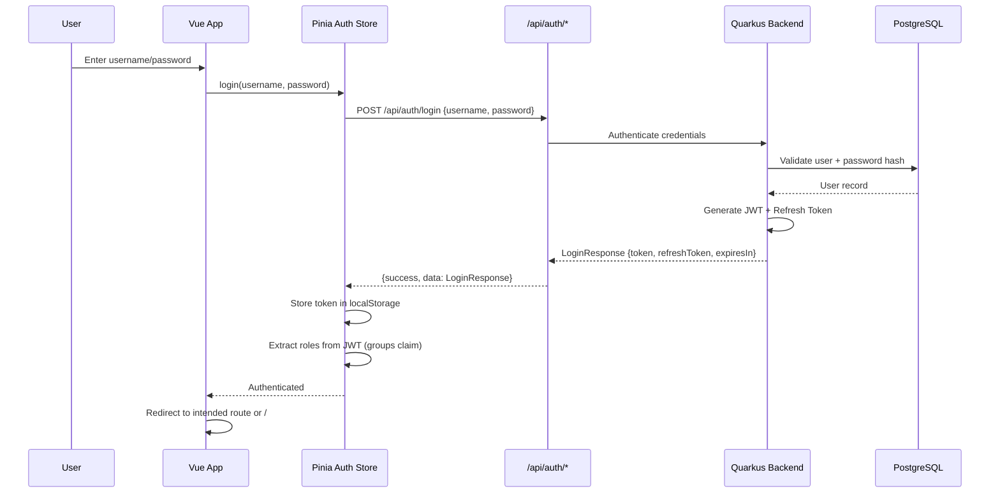
```mermaid
sequenceDiagram
    participant User
    participant Frontend as Vue App
    participant AuthStore as Pinia Auth Store
    participant API as /api/auth/*
    participant Backend as Quarkus Backend
    participant DB as PostgreSQL

    User->>Frontend: Enter username/password
    Frontend->>AuthStore: login(username, password)
    AuthStore->>API: POST /api/auth/login {username, password}
    API->>Backend: Authenticate credentials
    Backend->>DB: Validate user + password hash
    DB-->>Backend: User record
    Backend->>Backend: Generate JWT + Refresh Token
    Backend-->>API: LoginResponse {token, refreshToken, expiresIn}
    API-->>AuthStore: {success, data: LoginResponse}
    AuthStore->>AuthStore: Store token in localStorage
    AuthStore->>AuthStore: Extract roles from JWT (groups claim)
    AuthStore-->>Frontend: Authenticated
    Frontend->>Frontend: Redirect to intended route or /
```

### Token Refresh Sequence

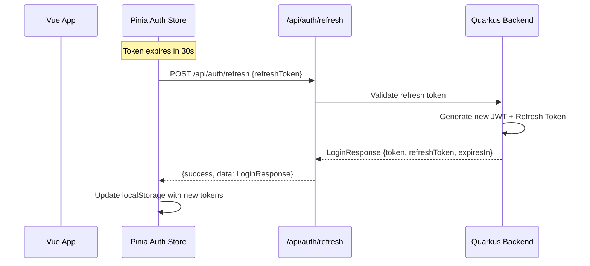
```mermaid
sequenceDiagram
    participant Frontend as Vue App
    participant AuthStore as Pinia Auth Store
    participant API as /api/auth/refresh
    participant Backend as Quarkus Backend

    Note over AuthStore: Token expires in 30s
    AuthStore->>API: POST /api/auth/refresh {refreshToken}
    API->>Backend: Validate refresh token
    Backend->>Backend: Generate new JWT + Refresh Token
    Backend-->>API: LoginResponse {token, refreshToken, expiresIn}
    API-->>AuthStore: {success, data: LoginResponse}
    AuthStore->>AuthStore: Update localStorage with new tokens
```

### Route Guard Flow

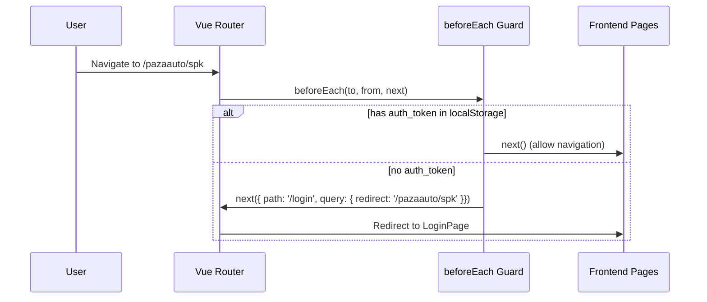
```mermaid
sequenceDiagram
    participant User
    participant Router as Vue Router
    participant Guard as beforeEach Guard
    participant Frontend as Frontend Pages

    User->>Router: Navigate to /pazaauto/spk
    Router->>Guard: beforeEach(to, from, next)
    alt has auth_token in localStorage
        Guard->>Frontend: next() (allow navigation)
    else no auth_token
        Guard->>Router: next({ path: '/login', query: { redirect: '/pazaauto/spk' }})
        Router->>Frontend: Redirect to LoginPage
    end
```

---

## API Reference

**Base URL**: `http://localhost:8080`  
**Swagger UI**: `http://localhost:8080/q/swagger-ui` (enable via `SWAGGER_ENABLED=true`)  
**OpenAPI Spec**: `http://localhost:8080/openapi`  
**Response Envelope**: All endpoints return `ApiResponse<T>` with `{ success, message, data }`

### Authentication

| Endpoint | Method | Auth | Description |
|----------|--------|------|-------------|
| `/api/auth/login` | POST | Public | Login with username/password |
| `/api/auth/logout` | POST | User | Logout (invalidate session) |
| `/api/auth/me` | GET | User | Get current user info |
| `/api/auth/refresh` | POST | Public | Refresh JWT token |

### Master Data

| Endpoint | Method | Auth | Description |
|----------|--------|------|-------------|
| `/api/users` | GET/POST/PUT/DELETE | Owner | User CRUD |
| `/api/users/paginated` | GET | Owner | Paginated users |
| `/api/roles` | GET/POST/PUT/DELETE | Owner | Role CRUD |
| `/api/roles/{id}/users` | GET/PUT | Owner | Manage role users |
| `/api/permissions` | GET/POST/PUT/DELETE | None | Permission CRUD |
| `/api/system-parameters` | GET/POST/PUT/DELETE | None | System config CRUD |
| `/api/pazaauto/barang` | GET/POST/PUT/DELETE | None | Goods/Items CRUD |
| `/api/pazaauto/barang?search=` | GET | None | Search items |
| `/api/pazaauto/jasa` | GET/POST/PUT/DELETE | None | Services/Labor CRUD |
| `/api/pazaauto/karyawan` | GET/POST/PUT/DELETE | None | Employee CRUD |
| `/api/pazaauto/karyawan/unregistered` | GET | None | Unregistered employees |
| `/api/pazaauto/karyawan-posisi` | GET/POST/PUT/DELETE | None | Employee positions CRUD |
| `/api/pazaauto/kendaraan` | GET/POST/PUT/DELETE | None | Vehicle types CRUD |
| `/api/pazaauto/kendaraan/merk/distinct` | GET | None | Distinct brands |
| `/api/pazaauto/kendaraan/jenis/distinct` | GET | None | Distinct types |
| `/api/pazaauto/kendaraan/jenis/by-merk` | GET | None | Types by brand |
| `/api/pazaauto/pelanggan` | GET/POST/PUT/DELETE | None | Customer CRUD |
| `/api/pazaauto/pelanggan/by-nopol/{nopol}` | GET/PUT | None | Customer by plate |
| `/api/pazaauto/supplier` | GET/POST/PUT/DELETE | None | Supplier CRUD |
| `/api/pazaauto/supplier?search=` | GET | None | Search suppliers |
| `/api/pazaauto/sparepart` | GET/POST/PUT/DELETE | None | Spare parts CRUD |
| `/api/pazaauto/sparepart/paginated` | GET | None | Paginated spare parts |

### Transactions

| Endpoint | Method | Auth | Description |
|----------|--------|------|-------------|
| `/api/pazaauto/spk` | GET/POST/PUT/DELETE | None | SPK CRUD |
| `/api/pazaauto/spk/paginated` | GET | None | Paginated SPK |
| `/api/pazaauto/spk/by-no-spk/{noSpk}` | GET | None | SPK by number |
| `/api/pazaauto/spk/unprocessed` | GET | None | Unprocessed SPKs |
| `/api/pazaauto/spk/get-next-spk-number` | GET | None | Next SPK number |
| `/api/pazaauto/spk/{id}` | GET | None | SPK with filled relations |
| `/api/pazaauto/spk/delete-by-no-spk/{noSpk}` | DELETE | None | Permanent delete SPK |
| `/api/pazaauto/spk-detail` | GET/POST/PUT/DELETE | None | SPK detail lines CRUD |
| `/api/pazaauto/penjualan` | GET/POST/PUT/DELETE | None | Sales CRUD |
| `/api/pazaauto/penjualan/paginated` | GET | None | Paginated sales |
| `/api/pazaauto/penjualan/{noPenjualan}/print` | GET | None | Sales print data |
| `/api/pazaauto/penjualan/cancel-by-no-spk/{noSpk}` | DELETE | None | Cancel sale, revert SPK |
| `/api/pazaauto/penjualan-detail` | GET/POST/PUT/DELETE | None | Sales detail CRUD |
| `/api/pazaauto/pembelian` | GET/POST/PUT/DELETE | None | Purchase CRUD |
| `/api/pazaauto/pembelian/paginated` | GET | None | Paginated purchases |
| `/api/pazaauto/pembelian/{noPembelian}` | GET | None | Purchase with details |
| `/api/pazaauto/pembelian/get-next-number` | GET | None | Next purchase number |
| `/api/pazaauto/pembelian/with-details` | POST | None | Create purchase + details |
| `/api/pazaauto/pembelian/{id}/with-details` | PUT | None | Update purchase + details |
| `/api/pazaauto/pembelian-detail` | GET/POST/PUT/DELETE | None | Purchase detail CRUD |
| `/api/pazaauto/pembelian-detail/by-pembelian/{id}` | GET | None | Details by purchase |
| `/api/pazaauto/absensi/clock-in` | POST | None | Clock in |
| `/api/pazaauto/absensi/clock-out` | POST | None | Clock out |
| `/api/pazaauto/absensi/today/{karyawanId}` | GET | None | Today's attendance |
| `/api/pazaauto/absensi/history` | GET | None | Attendance history |
| `/api/pazaauto/absensi/summary/{karyawanId}` | GET | None | Monthly summary |
| `/api/pazaauto/absensi/mark-absence` | POST | None | Manual absence (izin/sakit/etc) |

### Reports & Admin

| Endpoint | Method | Auth | Description |
|----------|--------|------|-------------|
| `/api/pazaauto/rekap-penjualan/paginated` | GET | None | Sales recap (paginated) |
| `/api/pazaauto/rekap-penjualan/{id}` | GET | None | Sales recap detail |
| `/api/pazaauto/rekap-penjualan/get-next-spk-number` | GET | None | Next SPK number |
| `/api/pazaauto/rekap-penjualan` | DELETE | None | Cancel SPK |
| `/api/pazaauto/summary` | GET | Owner | Dashboard analytics |
| `/api/audit-trail` | GET | Admin | All audit entries |
| `/api/audit-trail/paginated` | GET | Admin | Paginated audit |
| `/api/audit-trail/table/{tableName}` | GET | Admin | Audit by table |
| `/api/audit-trail/record/{recordId}` | GET | Admin | Audit by record |
| `/api/audit-trail/user/{userId}` | GET | Admin | Audit by user |
| `/health` | GET | Public | Health check |

---

## Menu Journeys

### 1. Login

**Route**: `/login`  
**Page**: `src/pages/LoginPage.vue`

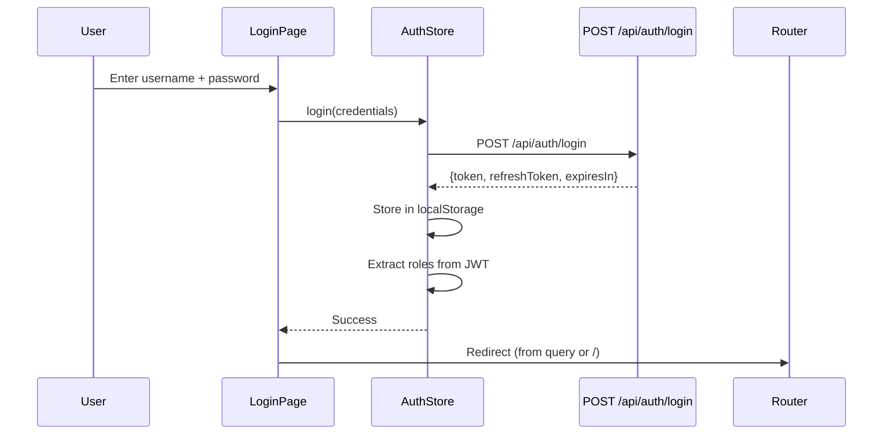
```mermaid
sequenceDiagram
    participant User
    participant LoginPage
    participant AuthStore
    participant API as POST /api/auth/login
    participant Router

    User->>LoginPage: Enter username + password
    LoginPage->>AuthStore: login(credentials)
    AuthStore->>API: POST /api/auth/login
    API-->>AuthStore: {token, refreshToken, expiresIn}
    AuthStore->>AuthStore: Store in localStorage
    AuthStore->>AuthStore: Extract roles from JWT
    AuthStore-->>LoginPage: Success
    LoginPage->>Router: Redirect (from query or /)
```

---

### 2. SPK (Service Work Order)

**Route**: `/pazaauto/spk`  
**Page**: `src/pages/pazaauto/SPKPage.vue`  
**Status Lifecycle**: `OPEN` → `PROSES` → `SELESAI`

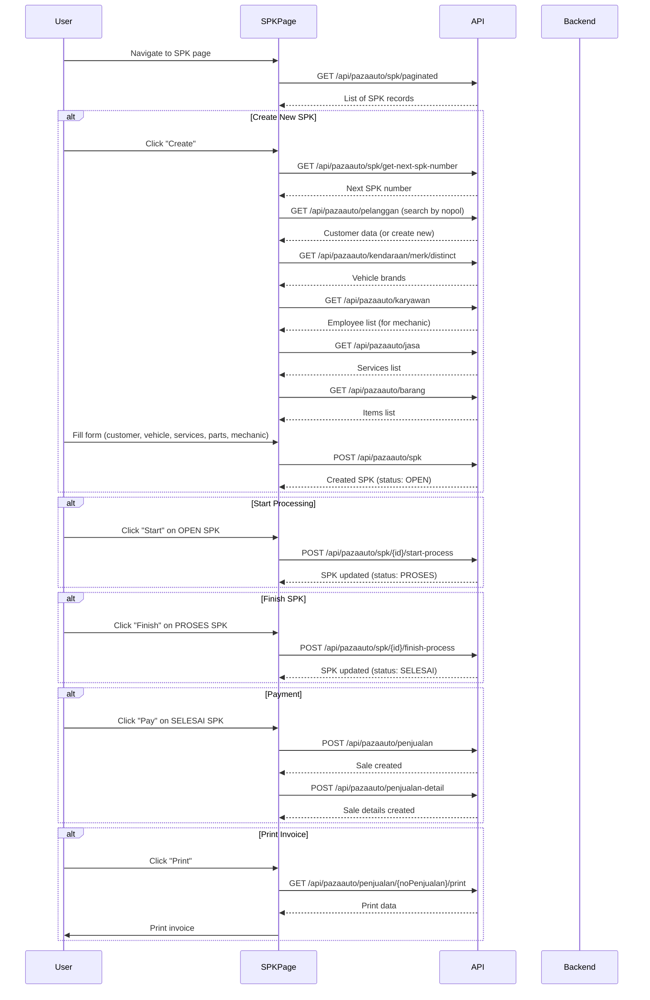
```mermaid
sequenceDiagram
    participant User
    participant SPKPage
    participant API
    participant Backend

    User->>SPKPage: Navigate to SPK page
    SPKPage->>API: GET /api/pazaauto/spk/paginated
    API-->>SPKPage: List of SPK records

    alt Create New SPK
        User->>SPKPage: Click "Create"
        SPKPage->>API: GET /api/pazaauto/spk/get-next-spk-number
        API-->>SPKPage: Next SPK number
        SPKPage->>API: GET /api/pazaauto/pelanggan (search by nopol)
        API-->>SPKPage: Customer data (or create new)
        SPKPage->>API: GET /api/pazaauto/kendaraan/merk/distinct
        API-->>SPKPage: Vehicle brands
        SPKPage->>API: GET /api/pazaauto/karyawan
        API-->>SPKPage: Employee list (for mechanic)
        SPKPage->>API: GET /api/pazaauto/jasa
        API-->>SPKPage: Services list
        SPKPage->>API: GET /api/pazaauto/barang
        API-->>SPKPage: Items list
        User->>SPKPage: Fill form (customer, vehicle, services, parts, mechanic)
        SPKPage->>API: POST /api/pazaauto/spk
        API-->>SPKPage: Created SPK (status: OPEN)
    end

    alt Start Processing
        User->>SPKPage: Click "Start" on OPEN SPK
        SPKPage->>API: POST /api/pazaauto/spk/{id}/start-process
        API-->>SPKPage: SPK updated (status: PROSES)
    end

    alt Finish SPK
        User->>SPKPage: Click "Finish" on PROSES SPK
        SPKPage->>API: POST /api/pazaauto/spk/{id}/finish-process
        API-->>SPKPage: SPK updated (status: SELESAI)
    end

    alt Payment
        User->>SPKPage: Click "Pay" on SELESAI SPK
        SPKPage->>API: POST /api/pazaauto/penjualan
        API-->>SPKPage: Sale created
        SPKPage->>API: POST /api/pazaauto/penjualan-detail
        API-->>SPKPage: Sale details created
    end

    alt Print Invoice
        User->>SPKPage: Click "Print"
        SPKPage->>API: GET /api/pazaauto/penjualan/{noPenjualan}/print
        API-->>SPKPage: Print data
        SPKPage->>User: Print invoice
    end
```

---

### 3. Penjualan (Sales)

**Route**: `/pazaauto/penjualan`  
**Page**: `src/pages/pazaauto/PenjualanPage.vue`

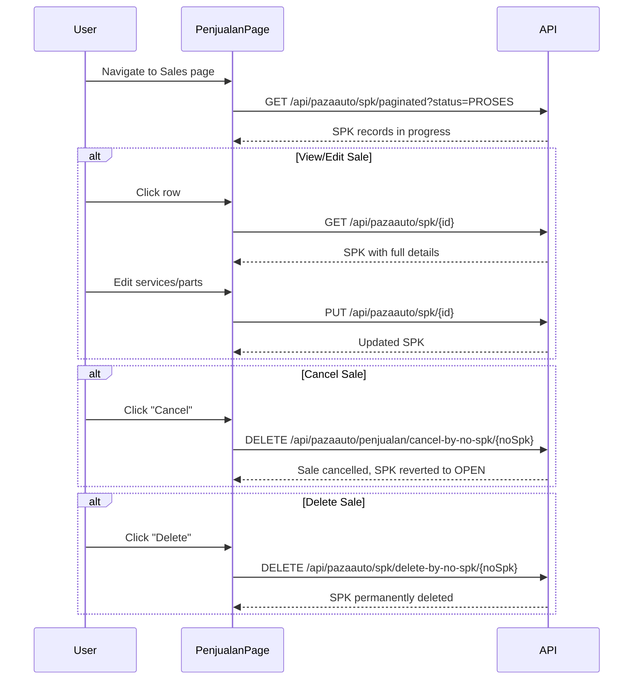
```mermaid
sequenceDiagram
    participant User
    participant PenjualanPage
    participant API

    User->>PenjualanPage: Navigate to Sales page
    PenjualanPage->>API: GET /api/pazaauto/spk/paginated?status=PROSES
    API-->>PenjualanPage: SPK records in progress

    alt View/Edit Sale
        User->>PenjualanPage: Click row
        PenjualanPage->>API: GET /api/pazaauto/spk/{id}
        API-->>PenjualanPage: SPK with full details
        User->>PenjualanPage: Edit services/parts
        PenjualanPage->>API: PUT /api/pazaauto/spk/{id}
        API-->>PenjualanPage: Updated SPK
    end

    alt Cancel Sale
        User->>PenjualanPage: Click "Cancel"
        PenjualanPage->>API: DELETE /api/pazaauto/penjualan/cancel-by-no-spk/{noSpk}
        API-->>PenjualanPage: Sale cancelled, SPK reverted to OPEN
    end

    alt Delete Sale
        User->>PenjualanPage: Click "Delete"
        PenjualanPage->>API: DELETE /api/pazaauto/spk/delete-by-no-spk/{noSpk}
        API-->>PenjualanPage: SPK permanently deleted
    end
```

---

### 4. Pembelian (Purchases)

**Route**: `/pazaauto/pembelian`  
**Page**: `src/pages/pazaauto/PembelianPage.vue`  
**Types**: SPAREPART, BARANG, OPERASIONAL

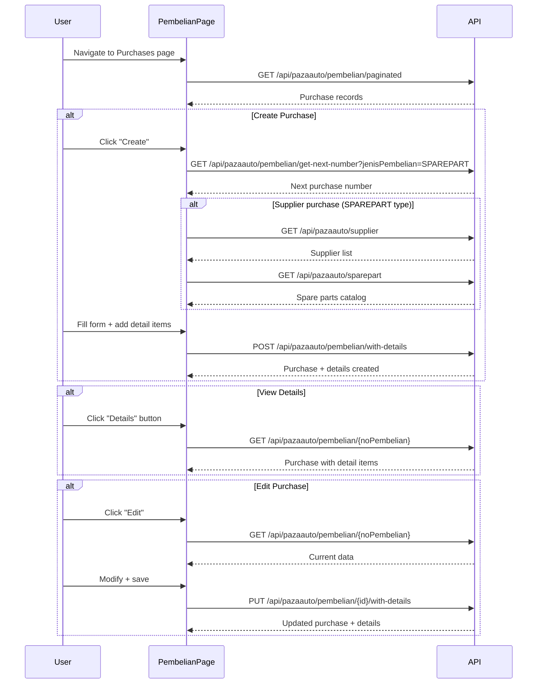
```mermaid
sequenceDiagram
    participant User
    participant PembelianPage
    participant API

    User->>PembelianPage: Navigate to Purchases page
    PembelianPage->>API: GET /api/pazaauto/pembelian/paginated
    API-->>PembelianPage: Purchase records

    alt Create Purchase
        User->>PembelianPage: Click "Create"
        PembelianPage->>API: GET /api/pazaauto/pembelian/get-next-number?jenisPembelian=SPAREPART
        API-->>PembelianPage: Next purchase number

        alt Supplier purchase (SPAREPART type)
            PembelianPage->>API: GET /api/pazaauto/supplier
            API-->>PembelianPage: Supplier list
            PembelianPage->>API: GET /api/pazaauto/sparepart
            API-->>PembelianPage: Spare parts catalog
        end

        User->>PembelianPage: Fill form + add detail items
        PembelianPage->>API: POST /api/pazaauto/pembelian/with-details
        API-->>PembelianPage: Purchase + details created
    end

    alt View Details
        User->>PembelianPage: Click "Details" button
        PembelianPage->>API: GET /api/pazaauto/pembelian/{noPembelian}
        API-->>PembelianPage: Purchase with detail items
    end

    alt Edit Purchase
        User->>PembelianPage: Click "Edit"
        PembelianPage->>API: GET /api/pazaauto/pembelian/{noPembelian}
        API-->>PembelianPage: Current data
        User->>PembelianPage: Modify + save
        PembelianPage->>API: PUT /api/pazaauto/pembelian/{id}/with-details
        API-->>PembelianPage: Updated purchase + details
    end
```

---

### 5. Pelanggan (Customers)

**Route**: `/pazaauto/pelanggan`  
**Page**: `src/pages/pazaauto/PelangganPage.vue`

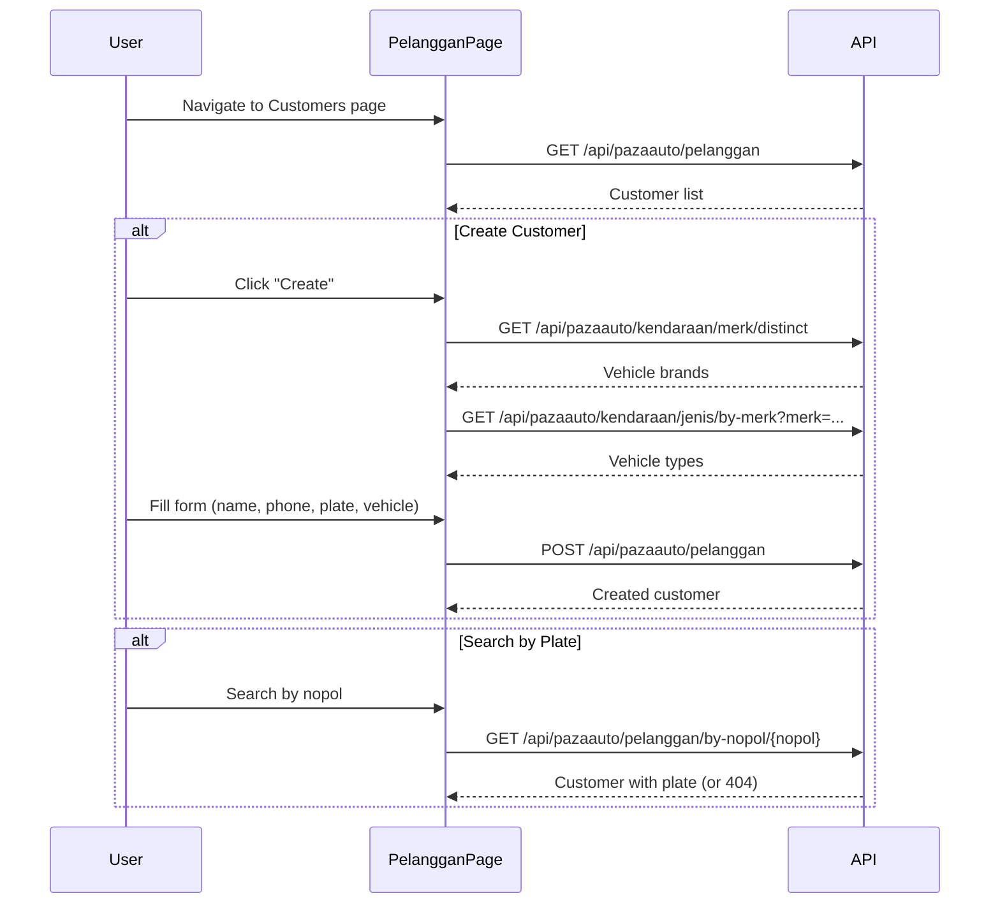
```mermaid
sequenceDiagram
    participant User
    participant PelangganPage
    participant API

    User->>PelangganPage: Navigate to Customers page
    PelangganPage->>API: GET /api/pazaauto/pelanggan
    API-->>PelangganPage: Customer list

    alt Create Customer
        User->>PelangganPage: Click "Create"
        PelangganPage->>API: GET /api/pazaauto/kendaraan/merk/distinct
        API-->>PelangganPage: Vehicle brands
        PelangganPage->>API: GET /api/pazaauto/kendaraan/jenis/by-merk?merk=...
        API-->>PelangganPage: Vehicle types
        User->>PelangganPage: Fill form (name, phone, plate, vehicle)
        PelangganPage->>API: POST /api/pazaauto/pelanggan
        API-->>PelangganPage: Created customer
    end

    alt Search by Plate
        User->>PelangganPage: Search by nopol
        PelangganPage->>API: GET /api/pazaauto/pelanggan/by-nopol/{nopol}
        API-->>PelangganPage: Customer with plate (or 404)
    end
```

---

### 6. Karyawan (Employees)

**Route**: `/pazaauto/karyawan`  
**Page**: `src/pages/pazaauto/KaryawanPage.vue`

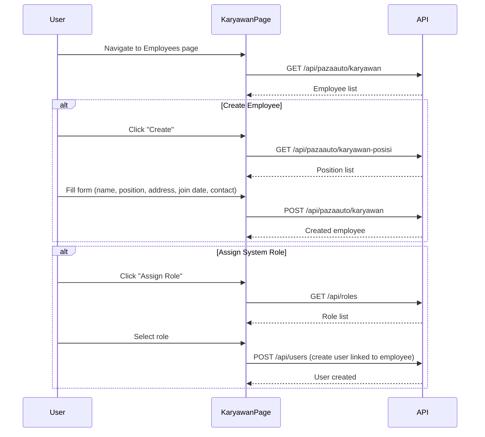
```mermaid
sequenceDiagram
    participant User
    participant KaryawanPage
    participant API

    User->>KaryawanPage: Navigate to Employees page
    KaryawanPage->>API: GET /api/pazaauto/karyawan
    API-->>KaryawanPage: Employee list

    alt Create Employee
        User->>KaryawanPage: Click "Create"
        KaryawanPage->>API: GET /api/pazaauto/karyawan-posisi
        API-->>KaryawanPage: Position list
        User->>KaryawanPage: Fill form (name, position, address, join date, contact)
        KaryawanPage->>API: POST /api/pazaauto/karyawan
        API-->>KaryawanPage: Created employee
    end

    alt Assign System Role
        User->>KaryawanPage: Click "Assign Role"
        KaryawanPage->>API: GET /api/roles
        API-->>KaryawanPage: Role list
        User->>KaryawanPage: Select role
        KaryawanPage->>API: POST /api/users (create user linked to employee)
        API-->>KaryawanPage: User created
    end
```

---

### 7. Absensi (Attendance)

**Route**: `/pazaauto/absensi`  
**Page**: `src/pages/pazaauto/AbsensiPage.vue`

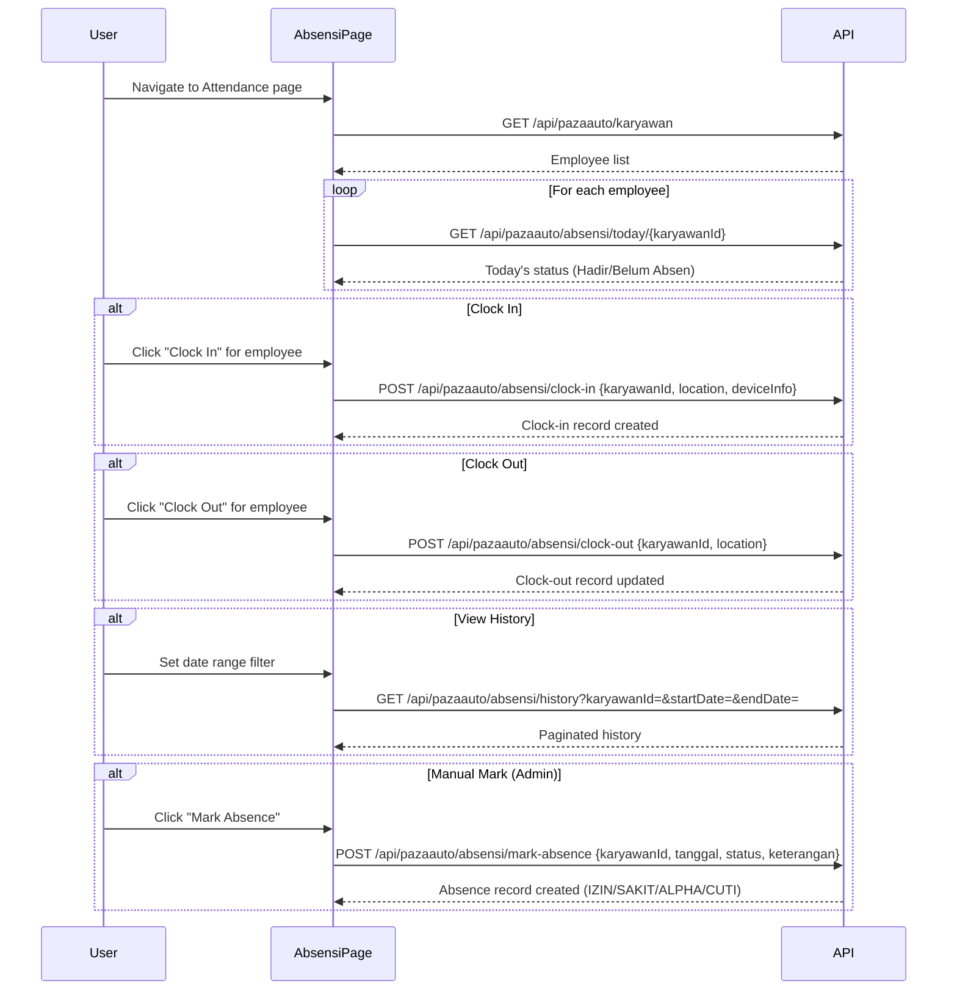
```mermaid
sequenceDiagram
    participant User
    participant AbsensiPage
    participant API

    User->>AbsensiPage: Navigate to Attendance page
    AbsensiPage->>API: GET /api/pazaauto/karyawan
    API-->>AbsensiPage: Employee list

    loop For each employee
        AbsensiPage->>API: GET /api/pazaauto/absensi/today/{karyawanId}
        API-->>AbsensiPage: Today's status (Hadir/Belum Absen)
    end

    alt Clock In
        User->>AbsensiPage: Click "Clock In" for employee
        AbsensiPage->>API: POST /api/pazaauto/absensi/clock-in {karyawanId, location, deviceInfo}
        API-->>AbsensiPage: Clock-in record created
    end

    alt Clock Out
        User->>AbsensiPage: Click "Clock Out" for employee
        AbsensiPage->>API: POST /api/pazaauto/absensi/clock-out {karyawanId, location}
        API-->>AbsensiPage: Clock-out record updated
    end

    alt View History
        User->>AbsensiPage: Set date range filter
        AbsensiPage->>API: GET /api/pazaauto/absensi/history?karyawanId=&startDate=&endDate=
        API-->>AbsensiPage: Paginated history
    end

    alt Manual Mark (Admin)
        User->>AbsensiPage: Click "Mark Absence"
        AbsensiPage->>API: POST /api/pazaauto/absensi/mark-absence {karyawanId, tanggal, status, keterangan}
        API-->>AbsensiPage: Absence record created (IZIN/SAKIT/ALPHA/CUTI)
    end
```

---

### 8. Rekap Penjualan (Sales Recap)

**Route**: `/pazaauto/rekap-penjualan`  
**Page**: `src/pages/pazaauto/RekapPenjualanPage.vue`

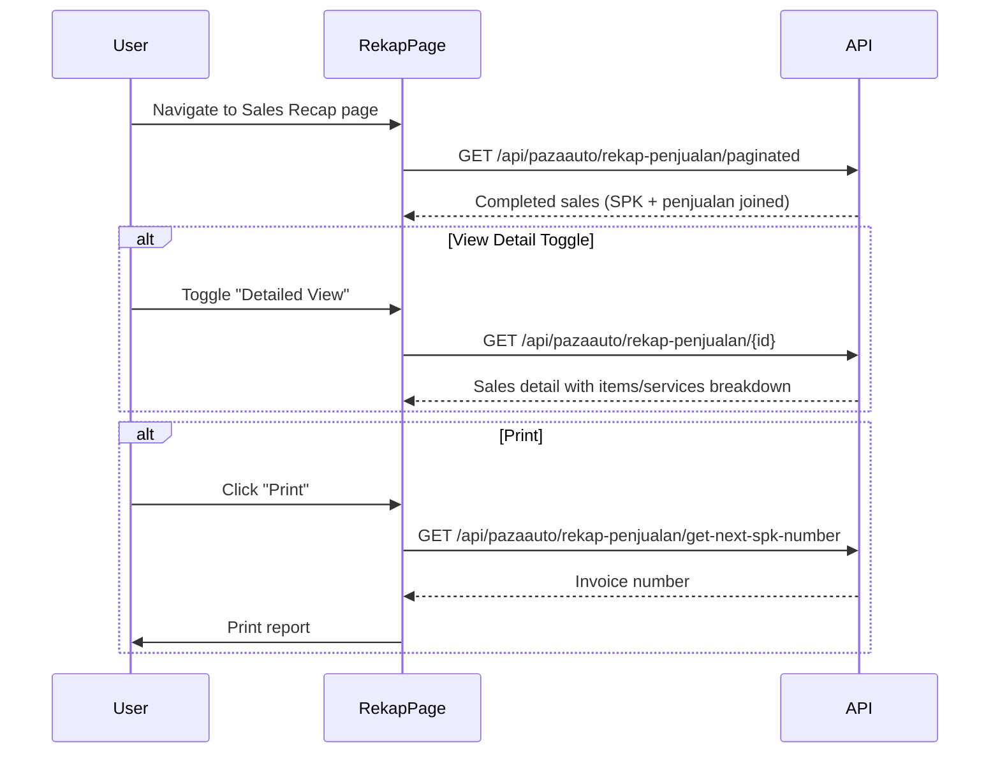
```mermaid
sequenceDiagram
    participant User
    participant RekapPage
    participant API

    User->>RekapPage: Navigate to Sales Recap page
    RekapPage->>API: GET /api/pazaauto/rekap-penjualan/paginated
    API-->>RekapPage: Completed sales (SPK + penjualan joined)

    alt View Detail Toggle
        User->>RekapPage: Toggle "Detailed View"
        RekapPage->>API: GET /api/pazaauto/rekap-penjualan/{id}
        API-->>RekapPage: Sales detail with items/services breakdown
    end

    alt Print
        User->>RekapPage: Click "Print"
        RekapPage->>API: GET /api/pazaauto/rekap-penjualan/get-next-spk-number
        API-->>RekapPage: Invoice number
        RekapPage->>User: Print report
    end
```

---

### 9. Rekap Pembelian (Purchase Recap)

**Route**: `/pazaauto/rekap-pembelian`  
**Page**: `src/pages/pazaauto/RekapPembelianPage.vue`

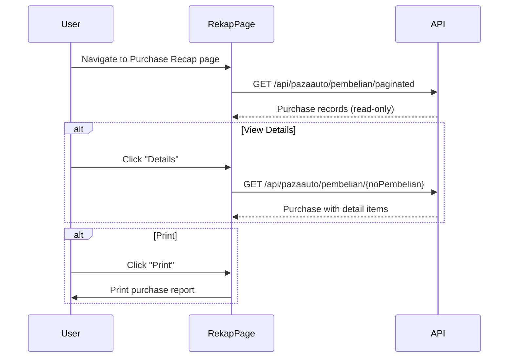
```mermaid
sequenceDiagram
    participant User
    participant RekapPage
    participant API

    User->>RekapPage: Navigate to Purchase Recap page
    RekapPage->>API: GET /api/pazaauto/pembelian/paginated
    API-->>RekapPage: Purchase records (read-only)

    alt View Details
        User->>RekapPage: Click "Details"
        RekapPage->>API: GET /api/pazaauto/pembelian/{noPembelian}
        API-->>RekapPage: Purchase with detail items
    end

    alt Print
        User->>RekapPage: Click "Print"
        RekapPage->>User: Print purchase report
    end
```

---

### 10. Summary (Dashboard)

**Route**: `/pazaauto/summary`  
**Page**: `src/pages/pazaauto/SummaryPage.vue`  
**Auth**: Owner only

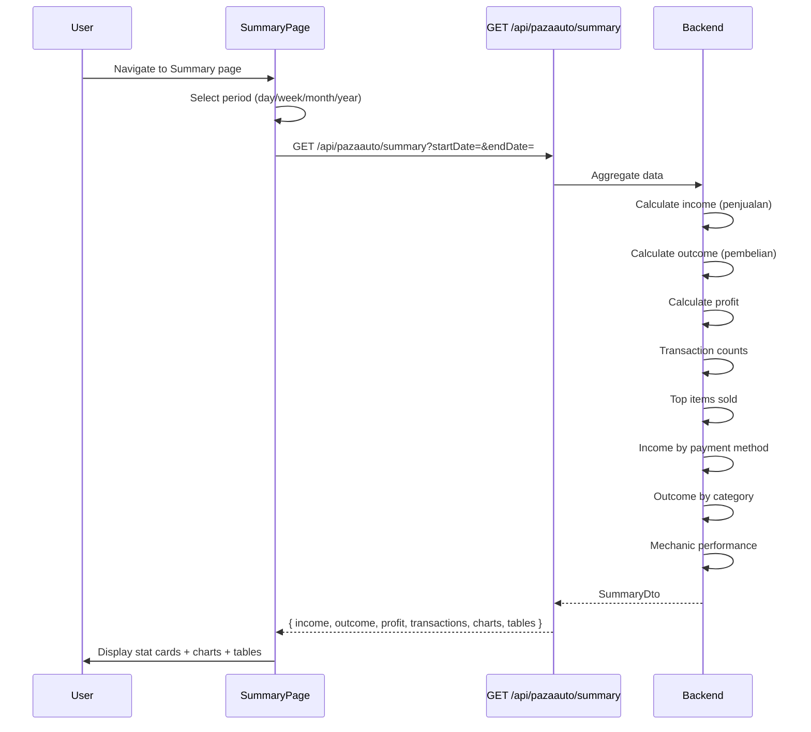
```mermaid
sequenceDiagram
    participant User
    participant SummaryPage
    participant API as GET /api/pazaauto/summary
    participant Backend

    User->>SummaryPage: Navigate to Summary page
    SummaryPage->>SummaryPage: Select period (day/week/month/year)
    SummaryPage->>API: GET /api/pazaauto/summary?startDate=&endDate=
    API->>Backend: Aggregate data

    Backend->>Backend: Calculate income (penjualan)
    Backend->>Backend: Calculate outcome (pembelian)
    Backend->>Backend: Calculate profit
    Backend->>Backend: Transaction counts
    Backend->>Backend: Top items sold
    Backend->>Backend: Income by payment method
    Backend->>Backend: Outcome by category
    Backend->>Backend: Mechanic performance

    Backend-->>API: SummaryDto
    API-->>SummaryPage: { income, outcome, profit, transactions, charts, tables }
    SummaryPage->>User: Display stat cards + charts + tables
```

---

### 11. User Management

**Route**: `/users`  
**Page**: `src/pages/master/UserPage.vue`

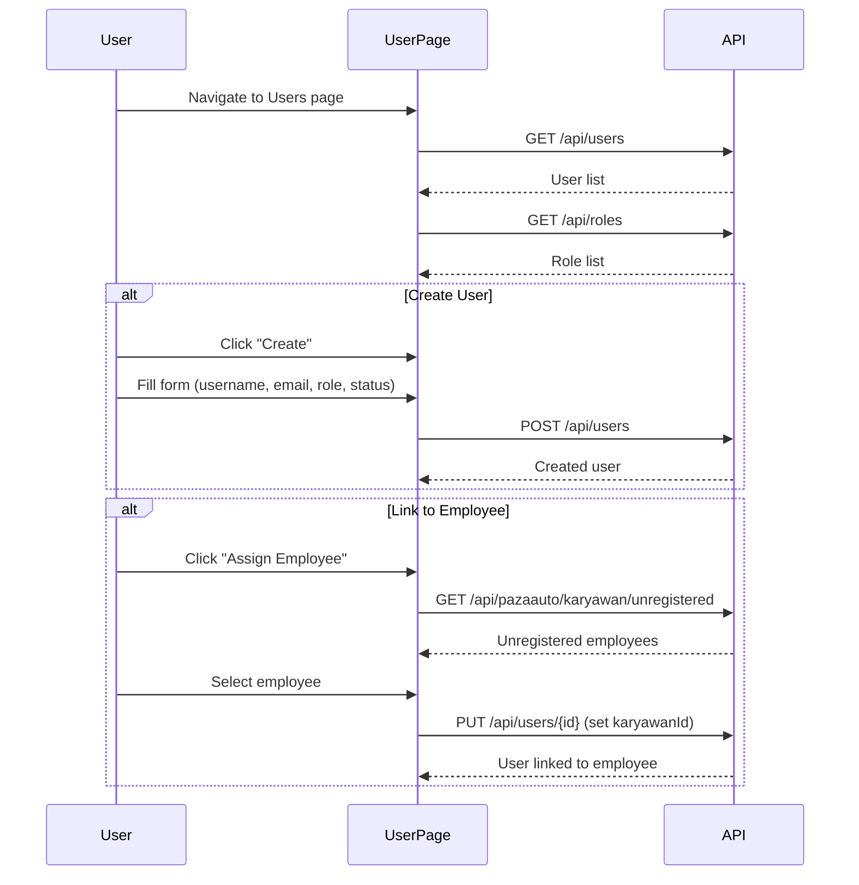
```mermaid
sequenceDiagram
    participant User
    participant UserPage
    participant API

    User->>UserPage: Navigate to Users page
    UserPage->>API: GET /api/users
    API-->>UserPage: User list
    UserPage->>API: GET /api/roles
    API-->>UserPage: Role list

    alt Create User
        User->>UserPage: Click "Create"
        User->>UserPage: Fill form (username, email, role, status)
        UserPage->>API: POST /api/users
        API-->>UserPage: Created user
    end

    alt Link to Employee
        User->>UserPage: Click "Assign Employee"
        UserPage->>API: GET /api/pazaauto/karyawan/unregistered
        API-->>UserPage: Unregistered employees
        User->>UserPage: Select employee
        UserPage->>API: PUT /api/users/{id} (set karyawanId)
        API-->>UserPage: User linked to employee
    end
```

---

### 12. Role Management

**Route**: `/roles` → `/roles/:id`  
**Pages**: `src/pages/master/RolePage.vue`, `src/pages/master/RoleViewPage.vue`

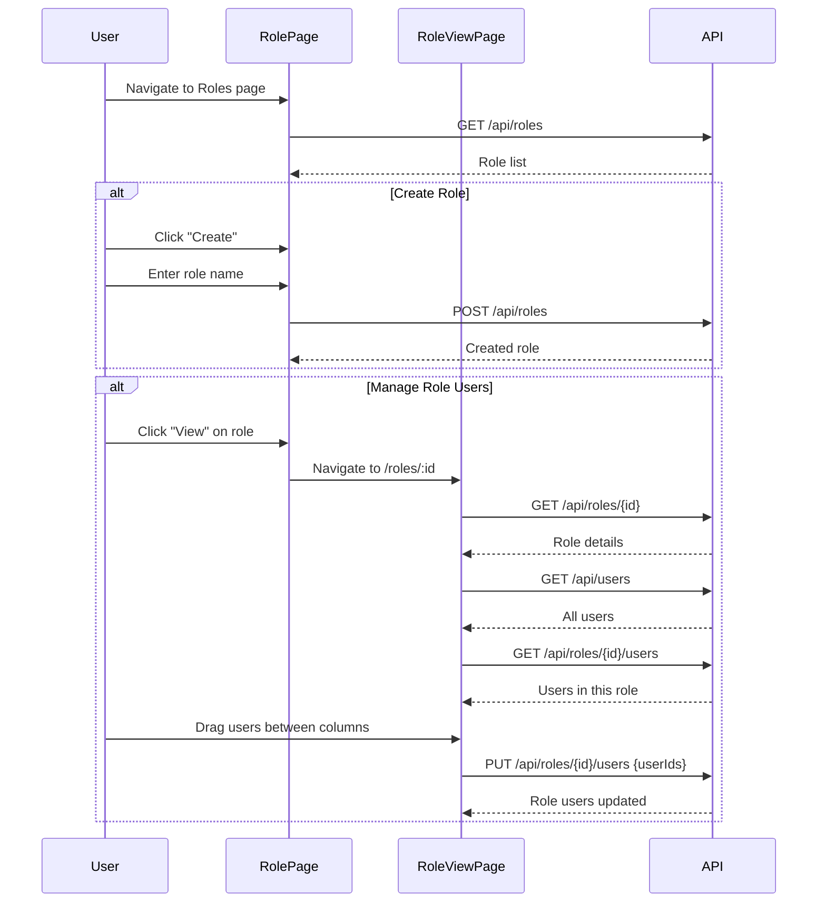
```mermaid
sequenceDiagram
    participant User
    participant RolePage
    participant RoleViewPage
    participant API

    User->>RolePage: Navigate to Roles page
    RolePage->>API: GET /api/roles
    API-->>RolePage: Role list

    alt Create Role
        User->>RolePage: Click "Create"
        User->>RolePage: Enter role name
        RolePage->>API: POST /api/roles
        API-->>RolePage: Created role
    end

    alt Manage Role Users
        User->>RolePage: Click "View" on role
        RolePage->>RoleViewPage: Navigate to /roles/:id
        RoleViewPage->>API: GET /api/roles/{id}
        API-->>RoleViewPage: Role details
        RoleViewPage->>API: GET /api/users
        API-->>RoleViewPage: All users
        RoleViewPage->>API: GET /api/roles/{id}/users
        API-->>RoleViewPage: Users in this role

        User->>RoleViewPage: Drag users between columns
        RoleViewPage->>API: PUT /api/roles/{id}/users {userIds}
        API-->>RoleViewPage: Role users updated
    end
```

---

### 13. Audit Trail

**Route**: `/admin/audit-trail`  
**Page**: `src/pages/admin/AuditTrailPage.vue`

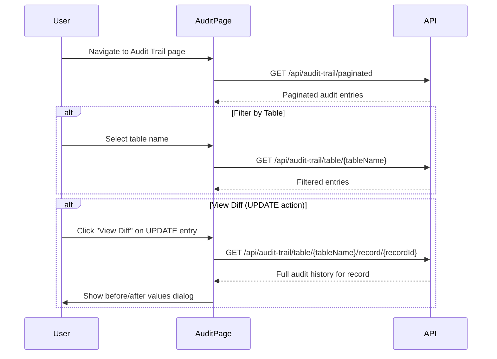
```mermaid
sequenceDiagram
    participant User
    participant AuditPage
    participant API

    User->>AuditPage: Navigate to Audit Trail page
    AuditPage->>API: GET /api/audit-trail/paginated
    API-->>AuditPage: Paginated audit entries

    alt Filter by Table
        User->>AuditPage: Select table name
        AuditPage->>API: GET /api/audit-trail/table/{tableName}
        API-->>AuditPage: Filtered entries
    end

    alt View Diff (UPDATE action)
        User->>AuditPage: Click "View Diff" on UPDATE entry
        AuditPage->>API: GET /api/audit-trail/table/{tableName}/record/{recordId}
        API-->>AuditPage: Full audit history for record
        AuditPage->>User: Show before/after values dialog
    end
```

---

### 14. Barang (Goods/Items)

**Route**: `/pazaauto/barang`  
**Page**: `src/pages/pazaauto/BarangPage.vue`

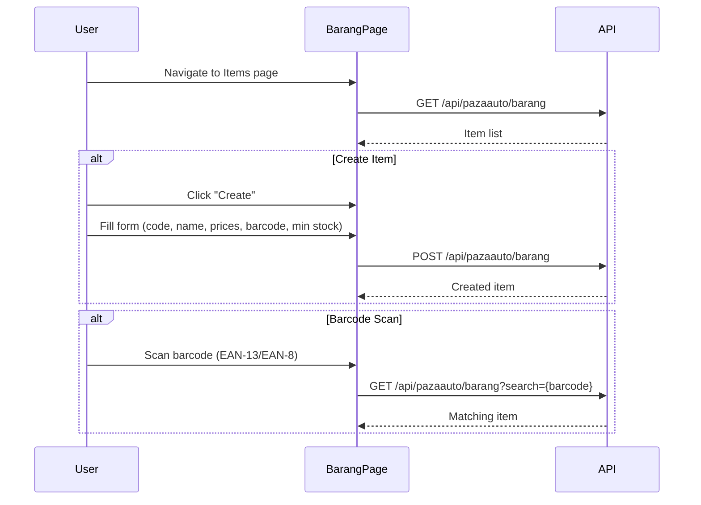
```mermaid
sequenceDiagram
    participant User
    participant BarangPage
    participant API

    User->>BarangPage: Navigate to Items page
    BarangPage->>API: GET /api/pazaauto/barang
    API-->>BarangPage: Item list

    alt Create Item
        User->>BarangPage: Click "Create"
        User->>BarangPage: Fill form (code, name, prices, barcode, min stock)
        BarangPage->>API: POST /api/pazaauto/barang
        API-->>BarangPage: Created item
    end

    alt Barcode Scan
        User->>BarangPage: Scan barcode (EAN-13/EAN-8)
        BarangPage->>API: GET /api/pazaauto/barang?search={barcode}
        API-->>BarangPage: Matching item
    end
```

---

### 15. Sparepart Management

**Route**: `/pazaauto/sparepart`  
**Page**: `src/pages/pazaauto/SparepartPage.vue`

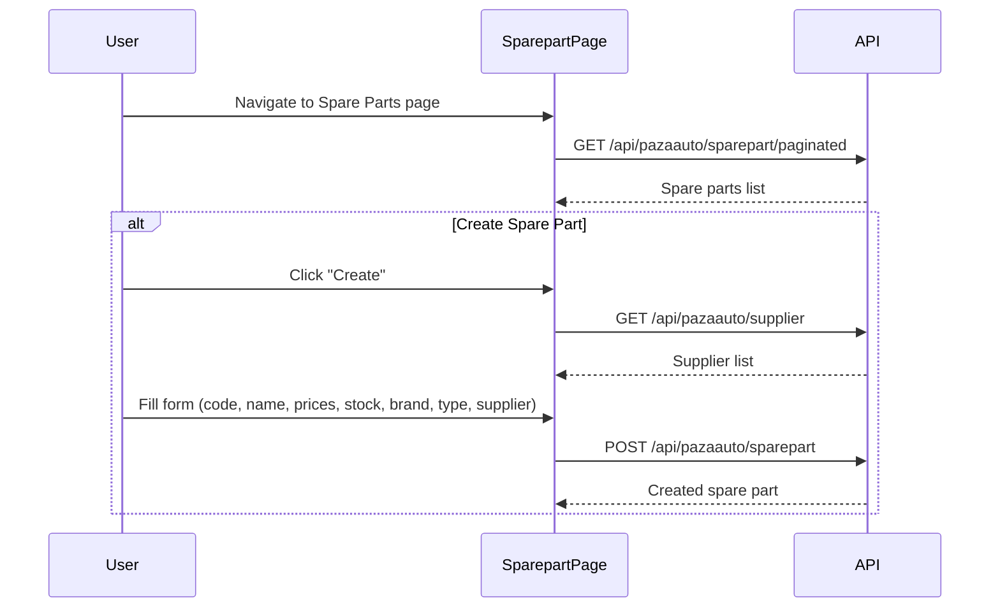
```mermaid
sequenceDiagram
    participant User
    participant SparepartPage
    participant API

    User->>SparepartPage: Navigate to Spare Parts page
    SparepartPage->>API: GET /api/pazaauto/sparepart/paginated
    API-->>SparepartPage: Spare parts list

    alt Create Spare Part
        User->>SparepartPage: Click "Create"
        SparepartPage->>API: GET /api/pazaauto/supplier
        API-->>SparepartPage: Supplier list
        User->>SparepartPage: Fill form (code, name, prices, stock, brand, type, supplier)
        SparepartPage->>API: POST /api/pazaauto/sparepart
        API-->>SparepartPage: Created spare part
    end
```

---

### 16. System Parameters

**Route**: `/system-parameters`  
**Page**: `src/pages/master/SystemParameterPage.vue`

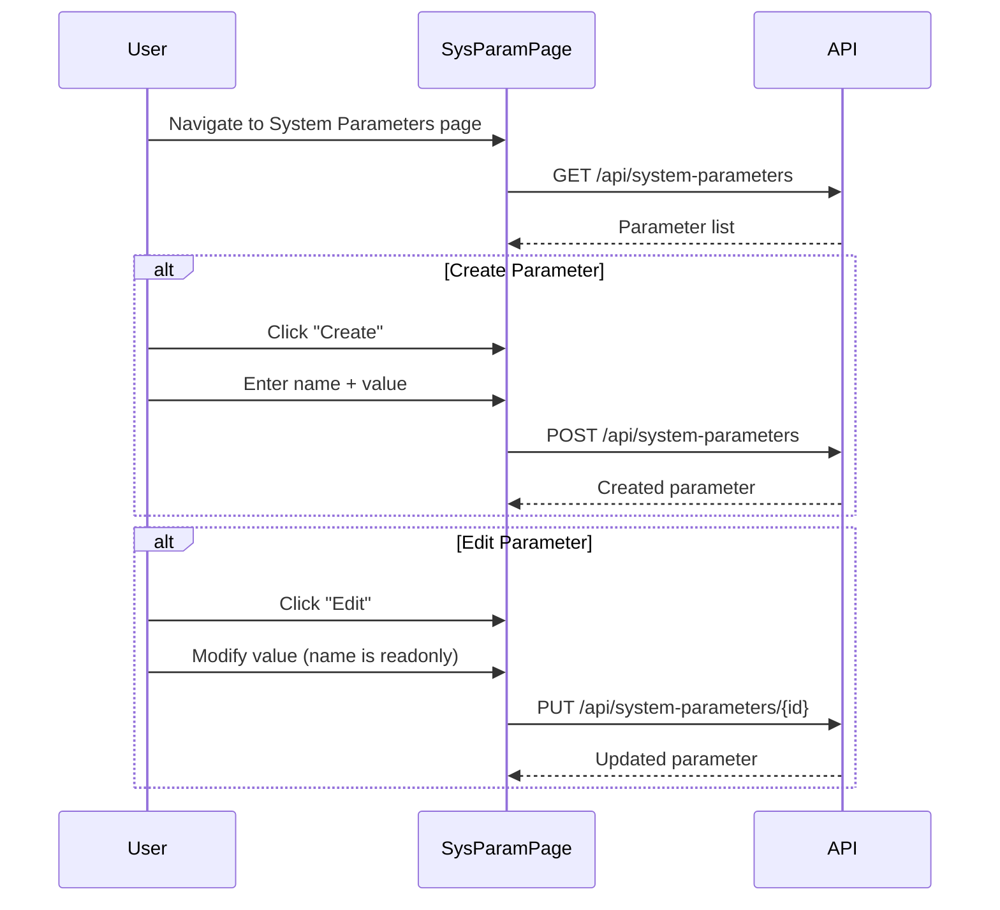
```mermaid
sequenceDiagram
    participant User
    participant SysParamPage
    participant API

    User->>SysParamPage: Navigate to System Parameters page
    SysParamPage->>API: GET /api/system-parameters
    API-->>SysParamPage: Parameter list

    alt Create Parameter
        User->>SysParamPage: Click "Create"
        User->>SysParamPage: Enter name + value
        SysParamPage->>API: POST /api/system-parameters
        API-->>SysParamPage: Created parameter
    end

    alt Edit Parameter
        User->>SysParamPage: Click "Edit"
        User->>SysParamPage: Modify value (name is readonly)
        SysParamPage->>API: PUT /api/system-parameters/{id}
        API-->>SysParamPage: Updated parameter
    end
```

---

### 17. Offline Status

**Route**: `/offline-status`  
**Page**: `src/pages/OfflineStatusPage.vue`

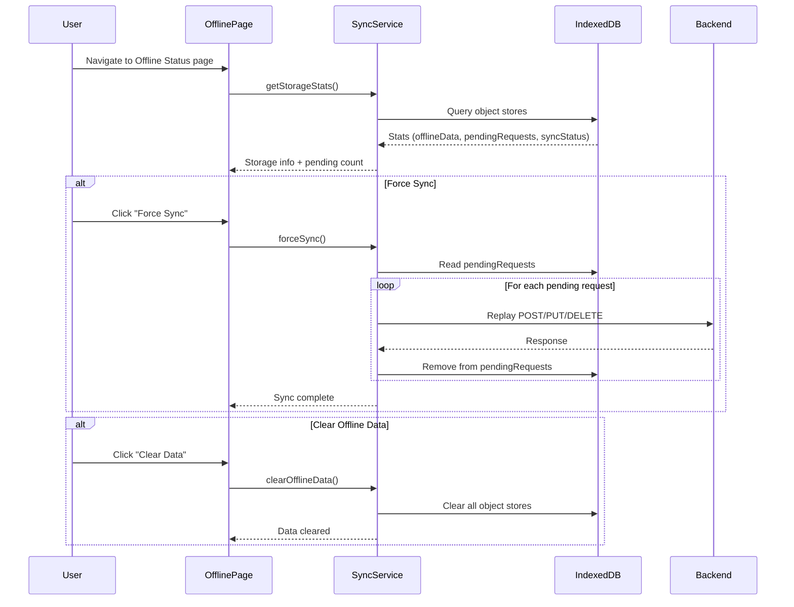
```mermaid
sequenceDiagram
    participant User
    participant OfflinePage
    participant SyncService
    participant IndexedDB

    User->>OfflinePage: Navigate to Offline Status page
    OfflinePage->>SyncService: getStorageStats()
    SyncService->>IndexedDB: Query object stores
    IndexedDB-->>SyncService: Stats (offlineData, pendingRequests, syncStatus)
    SyncService-->>OfflinePage: Storage info + pending count

    alt Force Sync
        User->>OfflinePage: Click "Force Sync"
        OfflinePage->>SyncService: forceSync()
        SyncService->>IndexedDB: Read pendingRequests
        loop For each pending request
            SyncService->>Backend: Replay POST/PUT/DELETE
            Backend-->>SyncService: Response
            SyncService->>IndexedDB: Remove from pendingRequests
        end
        SyncService-->>OfflinePage: Sync complete
    end

    alt Clear Offline Data
        User->>OfflinePage: Click "Clear Data"
        OfflinePage->>SyncService: clearOfflineData()
        SyncService->>IndexedDB: Clear all object stores
        SyncService-->>OfflinePage: Data cleared
    end
```

---

### 18. Clear Cache

**Route**: `/admin/clear-cache`  
**Page**: `src/pages/admin/ClearCachePage.vue`

```mermaid
sequenceDiagram
    participant User
    participant CachePage
    participant CacheUtil
    participant LocalStorage

    User->>CachePage: Navigate to Clear Cache page
    CachePage->>CacheUtil: Get cache stats
    CacheUtil->>LocalStorage: Read masterDataCache entries
    LocalStorage-->>CacheUtil: Total/active/expired counts
    CacheUtil-->>CachePage: Stats per endpoint

    alt Clear All Caches
        User->>CachePage: Click "Clear All"
        CachePage->>CacheUtil: Invalidate all
        CacheUtil->>LocalStorage: Remove all cache entries
        CacheUtil-->>CachePage: All cleared
    end

    alt Clear Specific Endpoint
        User->>CachePage: Click "Invalidate" on endpoint
        CachePage->>CacheUtil: Invalidate endpoint cache
        CacheUtil->>LocalStorage: Remove entries for endpoint
        CacheUtil-->>CachePage: Endpoint cache cleared
    end
```

---

## Role-Based Access

| Role | Access |
|------|--------|
| **Owner** | Full access including Summary dashboard, User CRUD, Role CRUD |
| **Admin** | Audit trail view, system management |
| **User** | Authenticated access to business features (SPK, Sales, Purchases, etc.) |

---

## Shared Components

| Component | Purpose | Used By |
|-----------|---------|---------|
| `GenericTable` | Reusable data table with pagination, search, filters, actions | All list pages |
| `GenericDialog` | Reusable form dialog for create/edit | All CRUD pages |
| `SPKDetailsEditor` | SPK detail editing (jasa + parts) | SPKPage, PenjualanPage |
| `SPKCustomerInfo` | Customer + vehicle display | SPKPage, PenjualanPage |

---

## State Management

**Pinia Stores**: `src/stores/auth-store.js`
- `login()` → `POST /api/auth/login`
- `logout()` → `POST /api/auth/logout`
- `refreshAccessToken()` → `POST /api/auth/refresh`
- `fetchUserInfo()` → `GET /api/auth/me`
- `initializeAuth()` → Auto-refresh on app start

**Offline Service**: `src/services/syncService.js`
- IndexedDB: `pasaAutoOfflineDB`
- Object stores: `offlineData`, `pendingRequests`, `syncStatus`
- Queues POST/PUT/DELETE when offline, replays on reconnect

**Cache**: `masterDataCache` utility (localStorage)
- Caches master data endpoints (barang, jasa, karyawan, etc.)
- Expiry-based invalidation
